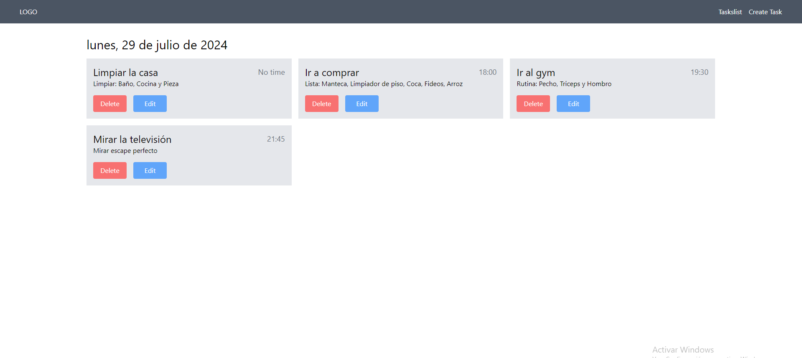

# Typescript, Nodejs, Express & Mongodb CRUD

En este proyecto aprenderemos a crear una app CRUD(Create, Read, Update y Delete) usando Nodejs, Mongodb y Typescript en el servidor y vite en el front.

En la aplicación podremos crear tareas, editarlas y eliminarlas. Se mostrarán en una lista de tareas.

## Dependencias

Las dependencias principales que necesitarás para este proyecto se dividen en dependencias de desarrollo y dependencias de producción. No es necesario instalarlas globalmente; es mejor instalarlas localmente para cada proyecto.

Para el servidor (backend):

1. Dependencias de producción:
    
    ```
    npm install express mongoose dotenv cors
    ```
    
2. Dependencias de desarrollo:
    
    ```
    npm install -D typescript @types/express @types/node @types/cors ts-node nodemon
    ```
    

Para el cliente (frontend con Vite):

1. Crea el proyecto Vite:
    
    ```
    npm create vite@latest client -- --template react-t
    ```
    
2. Dependencias adicionales (si las necesitas):
    
    ```
    npm install axios react-router-dom dotenv
    ```
    
3. Instalar Tailwind CSS y sus dependencias
    
    ```
    npm install -D tailwindcss postcss autoprefixer
    ```
    
    Generar los archivos de configuración de Tailwind
    
    ```
    npx tailwindcss init -p
    ```
    
    Configura los paths de tu contenido en `tailwind.config.js` 
    
    ```jsx
    /** @type {import('tailwindcss').Config} */
    export default {
      content: [
        "./index.html",
        "./src/**/*.{js,ts,jsx,tsx}",
      ],
      theme: {
        extend: {},
      },
      plugins: [],
    }
    ```
    
    Añade las directivas de Tailwind en tus archivos css. `App.css` y `index.css` 
    
    ```css
    @tailwind base;
    @tailwind components;
    @tailwind utilities;
    ```
    

## Configuraciones Previas

Para que las variables de entorno funcionen correctamente en un entorno de vite, debemos seguir estos pasos:

1. Ejecuta el siguiente comando en tu terminal para instalar las definiciones de tipo para Node.js:
    
    ```bash
    npm install --save-dev @types/node
    ```
    
2. Configurar `tsconfig.json` 
    
    ```json
    {
      "compilerOptions": {
        "target": "es5",
        "module": "commonjs",
        "strict": true,
        "esModuleInterop": true,
        "skipLibCheck": true,
        "forceConsistentCasingInFileNames": true,
        "types": ["node"]
      },
      "include": ["src/**/*"]
    }
    
    ```
    
3. Crear un archivo `.env` 
4. Configurar `dotenv` en tu proyecto. Se configura desde `vite.config.ts` 
    
    ```tsx
    // vite.config.ts
    import { defineConfig } from 'vite'
    import react from '@vitejs/plugin-react';
    import dotenv from 'dotenv';
    
    dotenv.config();
    
    // https://vitejs.dev/config/
    export default defineConfig({
      plugins: [react()],
      define: {
        'process.env': process.env
      }
    })
    
    ```
    

## Directorio

En nuestra carpeta raíz, vamos a crear dos carpetas:

- client: Frontend (Vite)
- server: Backend (Node.js, Express, TypeScript)

El directorio debería verse algo así:

```
proyecto-root/
│
├── client/                 # Frontend (Vite)
│   ├── public/
│   ├── src/
│   │   ├── assets/
│   │   ├── components/
│   │   ├── pages/
│   │   ├── services/
│   │   ├── types/
│   │   ├── App.tsx
│   │   └── main.tsx
│   ├── index.html
│   ├── package.json
│   ├── tsconfig.json
│   └── vite.config.ts
│
├── server/                 # Backend (Node.js, Express, TypeScript)
│   ├── src/
│   │   ├── config/
│   │   ├── controllers/
│   │   ├── models/
│   │   ├── routes/
│   │   ├── services/
│   │   ├── types/
│   │   ├── utils/
│   │   └── server.ts
│   ├── package.json
│   └── tsconfig.json
│
├── .gitignore
├── README.md
└── package.json            # Root package.json para scripts comunes
```

Ahora, vamos a explicar detalladamente cada directorio:

1. `client/`: Contiene todo el código del frontend.
    - `public/`: Archivos estáticos que se sirven directamente.
    - `src/`: Código fuente del frontend.
        - `assets/`: Imágenes, fuentes, etc.
        - `components/`: Componentes React reutilizables.
        - `pages/`: Componentes que representan páginas completas.
        - `services/`: Funciones para interactuar con la API.
        - `types/`: Definiciones de tipos TypeScript.
        - `App.tsx`: Componente principal de la aplicación.
        - `main.tsx`: Punto de entrada de la aplicación.
    - `index.html`: Archivo HTML principal.
    - `package.json`: Dependencias y scripts del frontend.
    - `tsconfig.json`: Configuración de TypeScript para el frontend.
    - `vite.config.ts`: Configuración de Vite.
2. `server/`: Contiene todo el código del backend.
    - `src/`: Código fuente del backend.
        - `config/`: Configuraciones (base de datos, variables de entorno, etc.).
        - `controllers/`: Lógica de negocio de las rutas.
        - `models/`: Modelos de Mongoose para MongoDB.
        - `routes/`: Definiciones de rutas Express.
        - `services/`: Lógica de negocio compleja o servicios externos.
        - `types/`: Definiciones de tipos TypeScript.
        - `utils/`: Funciones de utilidad.
        - `server.ts`: Punto de entrada del servidor.
    - `package.json`: Dependencias y scripts del backend.
    - `tsconfig.json`: Configuración de TypeScript para el backend.
3. Archivos en la raíz:
    - `.gitignore`: Especifica archivos y directorios ignorados por Git.
    - `README.md`: Documentación principal del proyecto.
    - `package.json`: Scripts comunes y configuraciones para todo el proyecto.

## App.tsx - Routes

Pensemos previamente qué queremos de esta app, que es lo que hace y donde queremos que lo haga. A mi se me ocurre que tenga tanto una ruta para ver las tareas en una lista, otra ruta para crear una tarea y otra para editar.

- ***/tasks/create***
- ***/tasks/list***
- ***/tasks/edit/:id***
- ***/***

Asi que el archivo principal App.tsx quedaria algo asi:

```tsx
import React from 'react';
import './App.css'
import { Route, Routes } from 'react-router-dom';
import NavBar from './components/NavBar';
import HomePage from './pages/HomePage';
import TaskListPage from './pages/TaskListPage';
import TaskCreatePage from './pages/TaskCreatePage';
import TaskEditPage from './pages/TaskEditPage';

const App: React.FC = () => {
  

  return (
    <>
     
      <NavBar />
      <Routes>
        <Route path="/" element={<HomePage/>} />  
        <Route path="/tasks/list" element={<TaskListPage/>} />
        <Route path="/tasks/create" element={<TaskCreatePage/>} />
        <Route path='/tasks/edit/:id' element={<TaskEditPage/>} />
      </Routes>
      
      
    </>
  );
}

export default App;
```

## Pages

Cada respectiva ruta mencionada anteriormente deberá tener su page que serán las siguientes:

`pages/` :

- `TaskCreatePage.tsx` : Página con formulario para crear una nueva tarea o editarla (’***/tasks/create***’)
- `TaskListPage.tsx` : Página para listar todas las tareas (’***/tasks/list***’)
- `TaksEditPage.tsx` : Página con formulario para editar una tarea existente (’***/tasks/edit/:id***’)
- `HomePage.tsx` :Página de inicio (’***/*** ’)

## Components

Pensemos que componentes vamos a necesitar. Primero y básico un navbar en el se podrá navegar entre las rutas ‘***/tasks/list***’ y ‘***/tasks/create***’ en la que en ellas podremos ver sus respectivas pages.

Segundo necesitaríamos una Card para la lista de tareas donde se pueda ver su título, descripción y que contenga un botón para eliminarla y otro para editarla.

Y por último un Formulario reutilizable para crear y editar las tareas.

`components/` :

- `Navbar.tsx`: Componente de navegación con enlaces a '/tasks/list' y '/tasks/create'.
- `TaskCard.tsx`: Componente para mostrar una tarea individual con botones de editar y eliminar.
- `TaskForm.tsx`: Formulario reutilizable para crear y editar tareas.

## Services

### Introducción:

El directorio `services` en el frontend es una parte crucial de la arquitectura de tu aplicación. Su función principal es encapsular toda la lógica relacionada con las llamadas a la API y la gestión de datos externos. Esto proporciona una capa de abstracción entre tus componentes de React y las fuentes de datos externas, lo que resulta en un código más limpio, mantenible y reutilizable.

Funciones principales del directorio `services`:

1. Centralizar las llamadas a la API
2. Manejar la lógica de autenticación y autorización
3. Transformar datos antes de enviarlos o después de recibirlos
4. Manejar errores de manera consistente
5. Proporcionar una interfaz limpia para que los componentes interactúen con los datos

### Para nuestro proyecto

Vamos a tener un archivo taskService.ts que manejará todas las operaciones relacionadas con las tareas. Tendrá los siguientes métodos:

- getAllTasks : Para obtener todas las tareas, solicitadas al backend - GET
- getTaskById: Para obtener los datos de una tarea en especifico - GET
- createTask:  Crear una tarea y enviarla al backend - POST
- updateTask: Editar un campo y enviarlo al backend - PUT
- deleteTask: Eliminar una tarea y enviarlo al backend - DELETE

```tsx
// services/taskService.ts

import axios from 'axios';
import { messages } from '../utils/message';
import { TaskType } from '../types/Task';

const API_URL = process.env.REACT_APP_API_URL || 'http://localhost:5000/api/tasks';

export const taskService = {
  
  getAllTasks: async (): Promise<TaskType[]> => {
      try {
        const response = await axios.get(API_URL)
        return response.data.tasks
        
        
      } catch (error: any) {
        throw new Error(messages.error.serverError)
      }
  },

  getTaskById: async (id: string): Promise<TaskType> => {
    try {
      const response = await axios.get(`${API_URL}/${id}`);
      return response.data.task;
    } catch (error: any) {
      throw new Error(messages.error.taskNotFound);
    }
  },

  createTask: async (task: Omit<TaskType, '_id'>): Promise<{ task: TaskType; message: string }> => {
    try {
      const response = await axios.post(API_URL, task);
      return response.data;
    } catch (error : any) {
      if (error.response && error.response.status === 400) {
        throw new Error(error.response.data.message);
      }
      throw new Error(messages.error.serverError);
    }
  },

  updateTask: async (id: string, task: Partial<TaskType>): Promise<{ task: TaskType; message: string }> => {
    try {
        const response = await axios.put(`${API_URL}/${id}`, task);
        return response.data;
    } catch (error: any) {
        if (error.response && error.response.status === 400) {
            throw new Error(error.response.data.message);
          }
          throw new Error(messages.error.serverError);
    }
  },

  deleteTask: async (id: string): Promise<string> => {
    try {
        const response =await axios.delete(`${API_URL}/${id}`);
        return response.data.message
    } catch (error: any) {
          throw new Error(messages.error.serverError);
    }
  }

}
```

## Types

Asi quedaria nuestro tipo de tarea/task con sus atributos

`types/Task.ts` :

```tsx
import { ObjectId } from 'mongoose'; 

// Interfaz para los datos de la tarea
export interface ITask {
  title: string;
  time?:string;
  description: string;
  completed?: boolean;
  createdAt?: Date;
  updatedAt?: Date;
}

// Tipo para usar en las operaciones del servicio
export type TaskType = ITask & {
  _id: ObjectId | string | undefined;
}
```

## Utils

En la carpeta utils tendremos un archivo `message.ts` donde exportáremos un objeto con dos objetos anidados: error & success. Escribiremos todos los mensajes que luego utilizaremos en el resto de la app.

```tsx
// utils/message.ts

export const messages = {
  error: {
    taskNotFound: "La tarea no fue encontrada.",
    serverError: "Ocurrió un error en el servidor.",
    invalidInput: "Los datos proporcionados no son válidos.",
    unauthorized: "No está autorizado para realizar esta acción.",
  },
  success: {
    taskCreated: "La tarea fue creada exitosamente.",
    taskUpdated: "La tarea fue actualizada exitosamente.",
    taskDeleted: "La tarea fue eliminada exitosamente.",
  }
};
```

Luego tendremos dos funciones

- `convertTimeToMinutes` que nos ayudara a ordenar la lista de tasks del horario más bajo al más alto.
- `showDate` que nos proporcionará la fecha del día actual.

  

## Backend

### Conectar a Mongodb

Dentro de `config/` vamos a crear un archivo mongodb.ts donde estableceremos la conexión a el.

```tsx
import moongose from 'mongoose';
import dotenv from 'dotenv';

//Cargar variables de entorno
dotenv.config();

//Obtener la URI  de MongoDB desde las variavles de entorno
const MONGO_URI = process.env.MONGO_URI ||'mongodb://localhost:27017/todo-app';

export const connectDB = async () => {
    try {

        await moongose.connect(MONGO_URI);
        console.log('MongoDB connected');

    } catch (error) {
        console.error('Error connecting to MongoDB', error);
        process.exit(1);//Salir de la app si no se puede conectar
    }
}
```

- Importamos `mongoose` para manejar la conexión a MongoDB y `dotenv` para cargar variables de entorno.
- Usamos `dotenv.config()` para cargar las variables de entorno desde un archivo `.env` (asegúrate de crear este archivo en la raíz de tu proyecto).
- Definimos `MONGO_URI` usando la variable de entorno `MONGO_URI`. Si no está definida, usamos una URI local por defecto.
- Creamos una función asíncrona `connectDB` que intenta conectarse a MongoDB.
- Dentro de `connectDB`, usamos un bloque try/catch para manejar errores de conexión.
- Si la conexión es exitosa, mostramos un mensaje en la consola.
- Si hay un error, lo registramos y cerramos la aplicación con `process.exit(1)`.

### Server.ts

Server.ts es nuestro archivo principal donde configuraremos el servidor Express.

```tsx

import express from 'express';
import cors from 'cors';
import taskRoutes from './routes/taskRoutes';
import { connectDB } from './config/mongodb';

const app = express();
app.use(express.json());
app.use(cors());
app.use('/api/tasks', taskRoutes);
connectDB();

const PORT = process.env.PORT || 5000;
app.listen(PORT, () => console.log(`Server running on port ${PORT}`));
```

### Types

`server/src/types/Task.ts`

```tsx
import { Document, Types } from 'mongoose';

// Interfaz para los datos de la tarea
export interface ITask {
  title: string;
  description: string;
  time?:string;
  completed?: boolean;
  createdAt?: Date;
  updatedAt?: Date;
}

// Interfaz para el documento de Mongoose
export interface ITaskDocument extends ITask, Document {
  _id: Types.ObjectId;
  title: string;
  time?: string;
  description: string;
  completed?: boolean;
  createdAt?: Date;
  updatedAt?: Date;
}
```

### Models

En la carpeta `models/` tendremos `Task.ts` donde definiremos el modelo Mongoose para la tarea/task.

Esta carpeta siempre es exclusivamente para Mongoose y MongoDB.

```tsx

import mongoose,{ Schema } from 'mongoose';
import { ITaskDocument } from '../types/Task';

const TaskSchema: Schema = new Schema<ITaskDocument>({
  title: { type: String, required: true },
  time: { type: String, required: false },
  description: { type: String, required: true },
  completed: { type: Boolean, default: false }
}, {
  timestamps: true
});

 const Task = mongoose.models.Task ||mongoose.model<ITaskDocument>('Task', TaskSchema);

export default Task
```

### Routes

En la carpeta `routes/` vamos a crear `taskRoutes.ts` el archivo donde tendrá todas las rutas HTTP para las operaciones relacionadas con las tareas. Básicamente conectamos la url de la api con los controladores/handlers.

Se verá algo así:

```tsx
import express from 'express';
import {
    getAllTasks,
    createTask,
    getTaskById,
    updateTask,
    deleteTask
} from "../controllers/taskController";

const router = express.Router();

// GET /api/tasks
router.get('/', getAllTasks);

// POST /api/tasks
router.post('/', createTask);

router.get('/:id', getTaskById);

// PUT /api/tasks/:id
router.put('/:id', updateTask);

// DELETE /api/tasks/:id
router.delete('/:id', deleteTask);

export default router
```

### Controllers

Aquí tendremos la lógica para manejar las operaciones CRUD de las tareas con la base de datos. Dentro de la carpeta creamos un archivo `taskContoller.ts`

```tsx
import { Request, Response } from "express";
import Task  from "../models/Task";
import { messages } from "../utils/messages";
import { connectDB } from "../config/mongodb";

interface BodyProps {
  _id?: string;
  title?: string;
  time?: string;
  description?: string;
}

export const createTask = async (req: Request, res: Response) => {
  try {
    await connectDB();

    //Obtner datos del body
    const body: BodyProps = await req.body;

    //Destructuración
    const { title, time, description } = body;

    //Validar datos
    if (!title  || !description) {
      return res
        .status(400)
        .json({ message: messages.error.invalidInput });
    }

    //Crear tarea
    const newTask = new Task({
      title,
      time,
      description,
    });

    await newTask.save();
    res
      .status(201)
      .json({ message: messages.success.taskCreated, task: newTask });
  } catch (error) {
    res
      .status(400)
      .json({ message: messages.error.invalidInput, error: error });
  }
};

export const getAllTasks = async (req: Request, res: Response) => {
  try {
    await connectDB();

    const tasks = await Task.find({});
    res.status(200).json({ tasks });
  } catch (error) {
    res.status(400).json({ message: messages.error.serverError, error: error });
  }
};

export const getTaskById = async (req: Request, res: Response) => {
  try {
    await connectDB();
    const task = await Task.findById(req.params.id);
    res.status(200).json({ task });
  } catch (error) {
    res.status(400).json({ message: messages.error.serverError, error: error });
  }
}

export const updateTask = async (req: Request, res: Response) => {
  try {
    await connectDB();

    //Obtner datos del body
    const body: BodyProps = await req.body;

    //Obtener id de la url
    const id = req.params.id;

    //Destructuración
    const {title, time, description } = body;

    //Validar datos
    if (!title ||  !description || !id) {
      return res
        .status(400)
        .json({ message: messages.error.invalidInput });
    }

    //Actualizar tarea
    const oldTask = await Task.findByIdAndUpdate(id, { title, time, description });

    const newTask = await Task.findById(id);

    res.status(200).json({ message: messages.success.taskUpdated, oldTask: oldTask, newTask: newTask });

  } catch (error) {
    res
      .status(400)
      .json({ message: messages.error.invalidInput, error: error });
  }
};

export const deleteTask = async (req: Request, res: Response) => {
    try {
        await connectDB();

        const id = req.params.id;
        

        if (!id) {
          return res
            .status(400)
            .json({ message: messages.error.invalidInput });
        }

        const task = await Task.findByIdAndDelete(id);

        res.status(200).json({ message: messages.success.taskDeleted, task: task });

    } catch (error) {
        res.status(400).json({ message: messages.error.serverError, error: error });
    }
};

```

## Nuevo Directorio

Después de comentar cómo va a estar formada nuestra app podemos deducir que nuestro directorio final quedará algo así:

```
proyecto-root/
│
├── client/
│   ├── src/
│   │   ├── components/
│   │   │   ├── Navbar.tsx
│   │   │   ├── TaskCard.tsx
│   │   │   └── TaskForm.tsx
│   │   ├── pages/
│   │   │   ├── HomePage.tsx
│   │   │   ├── TaskListPage.tsx
│   │   │   ├── TaskCreatePage.tsx
│   │   │   └── TaskEditPage.tsx
│   │   ├── services/
│   │   │   └── taskService.ts
│   │   ├── types/
│   │   │   └── Task.ts
│   │   ├── utils/
│   │   │   ├── convertTimeToMinutes.ts
│   │   │   ├── message.ts
│   │   │   └── showDate.ts
│   │   ├── App.tsx
│   │   └── main.tsx
│   ├── .env
│   ├── .gitignore
│   ├── index.html
│   ├── package.json
│   ├── tsconfig.json
│   └── vite.config.ts
│
├── server/
│   ├── src/
│   │   ├── controllers/
│   │   │   └── taskController.ts
│   │   ├── models/
│   │   │   └── Task.ts
│   │   ├── routes/
│   │   │   └── taskRoutes.ts
│   │   ├── config/
│   │   │   └── mongodb.ts
│   │   ├── types/
│   │   │   └── Task.ts
│   │   ├── utils/
│   │   │   └── message.ts
│   │   └── server.ts
│   ├── .env
│   ├── .gitignore
│   ├── package.json
│   └── tsconfig.json
│
├── .gitignore
├── README.md
└── package.json
```

## Vista previa

Así se verán las pages con el proyecto terminado.

***/tasks/list***



El horario que se ve en la esquina superior derecha de la card **no** es el horario de cuando se creo, sino cuando debo hacer esa tarea.

***/tasks/create***


***/tasks/edit***


